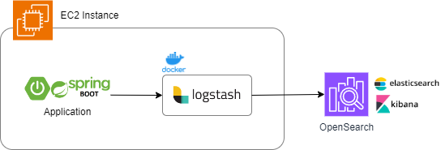

# Basic Logstash configuration to push Spring logs to AWS OpenSearch
In this repository you can find a basic working example of logstash running in a docker container.
The service is responsible to read logs from your Spring logs folder and push them to AWS OpenSearch.

## Requirements for EC2 instance
- Spring app running in EC2 instance
- Docker + Docker Desktop running in EC2 instance
- OpenSearch domain available on AWS 

## Steps
- Copy repository in you EC2 instance
- Edit *docker-compose.yml* and *logstash.conf* for you use case
- Run *docker-compose up -d* from the root folder of the repo